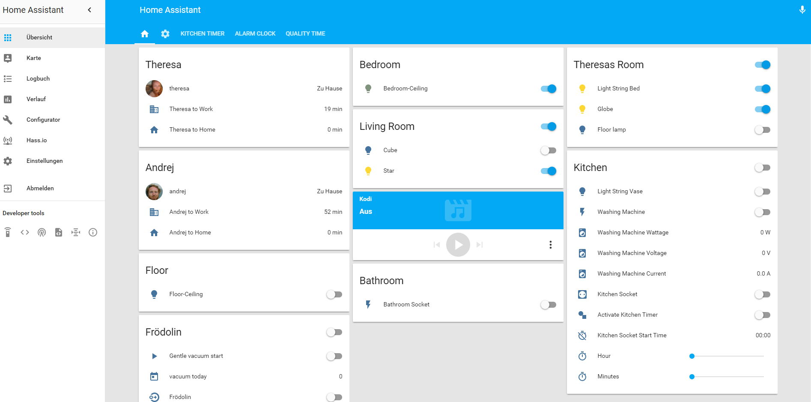
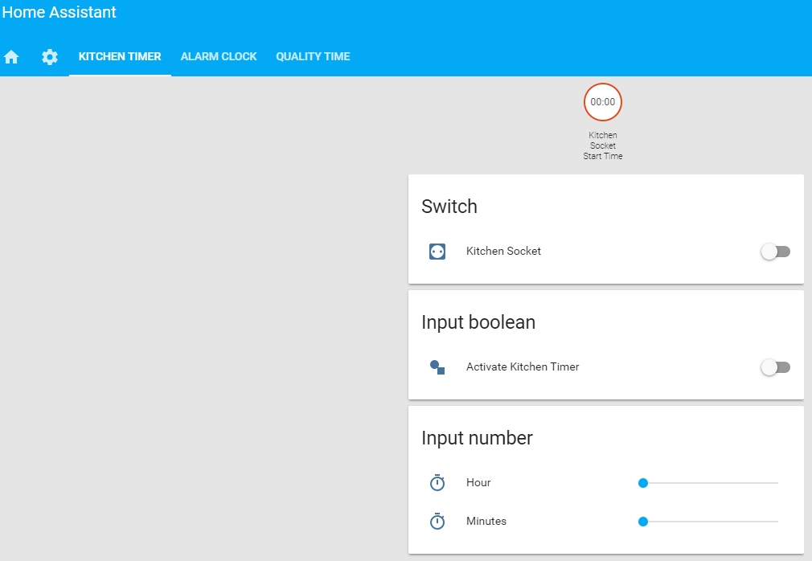
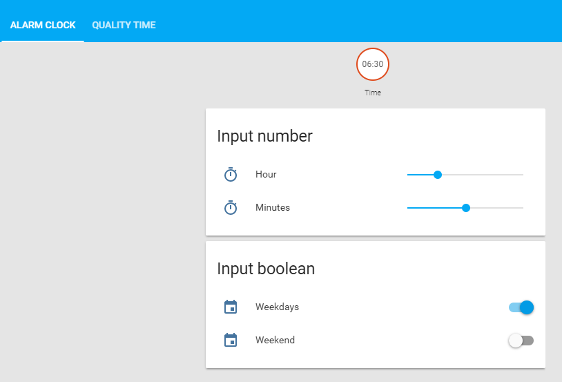

# This is my personal Home Assistant configuration with HASS.IO

I am using Home Assistant with [HASS.IO](https://home-assistant.io/) on a Raspberry Pi 3.

## Screenshots

## Hardware

List of my current used hardware:

- Sonoff devices with [Tasmota Firmware](https://github.com/arendst/Sonoff-Tasmota)
  - 2 Sonoff S20
  - 3 Sonoff POW
    - Washing machine
  - 6 Sonfoff Basics
    - All 6 are used for lights
- 2 Phillips Hue bulps with one bridge
- Fritz Box Router
- Xiaomi vacuum generation one

## Features I use with Home Assistant

- Automaticly vacuum once a day and send a notification
- Alarm clock for turning on the lights in the morning
- Kitchen socket with timer function for the rice cooker
- Quality Time App for me and my significant other
- Turn off all lights, when nobody is home
- Track location for me and my significant other vi Owntracks
- Washing machine socket with voltage, current and wattage sensor
- Traveltime for me an my significant other
  - To hork
  - To home
- Charging station in bathroom for some hardware:
  - Bluetooth speaker
  - Razor
  - Tooth brush
  - Garmin Vivoactive sport watch
- Check regulary mails against [Have I been pwnd?](https://haveibeenpwned.com/)
- Check my internet provider with speedtest.net
- Google Assistant to control some switches, lights, etc.
- Use the the [HASS Configurator](https://home-assistant.io/addons/configurator/) Add-On for [HASS.IO](https://home-assistant.io/)

## More information

I want to write down my home assistant journey in blog (german) called: [heim.equipment](https://heim.equipment)
